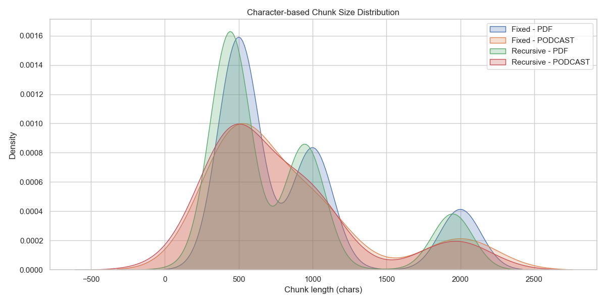
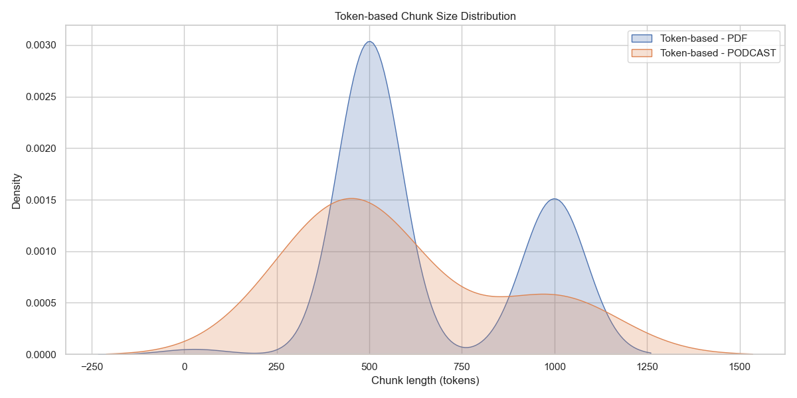
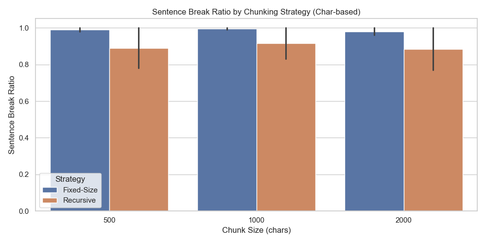

# Chunking Analysis Report

## Comparison Table of All Strategies

| Strategy    | Content   |   Chunk Size |   Overlap |   Num Chunks |   Sentence Break Ratio |   Paragraph Break Ratio |
|:------------|:----------|-------------:|----------:|-------------:|-----------------------:|------------------------:|
| Fixed-Size  | PDF       |          500 |         0 |          391 |                   0.98 |                       1 |
| Fixed-Size  | Podcast   |          500 |         0 |           20 |                   1    |                       1 |
| Fixed-Size  | PDF       |         1000 |        50 |          206 |                   0.99 |                       1 |
| Fixed-Size  | Podcast   |         1000 |        50 |           11 |                   1    |                       1 |
| Fixed-Size  | PDF       |         2000 |       100 |          103 |                   0.96 |                       1 |
| Fixed-Size  | Podcast   |         2000 |       100 |            6 |                   1    |                       1 |
| Recursive   | PDF       |          500 |        50 |          445 |                   0.78 |                       1 |
| Recursive   | Podcast   |          500 |        50 |           23 |                   1    |                       1 |
| Recursive   | PDF       |         1000 |       200 |          240 |                   0.83 |                       1 |
| Recursive   | Podcast   |         1000 |       200 |           13 |                   1    |                       1 |
| Recursive   | PDF       |         2000 |       200 |          110 |                   0.77 |                       1 |
| Recursive   | Podcast   |         2000 |       200 |            6 |                   1    |                       1 |
| Token-Based | PDF       |          500 |        50 |          119 |                   0.95 |                       0 |
| Token-Based | Podcast   |          500 |        50 |            5 |                   0.8  |                       1 |
| Token-Based | PDF       |         1000 |       100 |           60 |                   0.95 |                       0 |
| Token-Based | Podcast   |         1000 |       100 |            3 |                   0.67 |                       1 |

## Recommendations

### For PDF Documents:
**Recommended Strategy:** Recursive + Token-based
**Reasoning:**
- Preserves structured content (headings, sections, paragraphs)
- Token-based ensures LLM context window compliance
**Optimal chunk size & overlap:** Recursive 1000–2000 chars, overlap 100–200; Token 500–1000 tokens, overlap 50–100

### For Podcast Transcripts:
**Recommended Strategy:** Token-based (optionally with small recursive chunks)
**Reasoning:**
- Podcasts are continuous conversation transcripts
- Token-based ensures all chunks fit LLM context windows
**Optimal chunk size & overlap:** 500–1000 tokens, overlap 50–100

### Trade-offs Summary:

| Strategy | Pros | Cons | Best For |
|----------|------|------|----------|
| Fixed-Size | Simple, predictable | Breaks context and sentences | Quick prototyping, uniform content |
| Recursive | Preserves structure & semantics | Slightly slower, more complex | Structured documents (PDFs, articles) |
| Token-Based | Accurate for LLMs; ensures context window compliance | Boundaries may not match sentences | Any content for LLM integration |
| Semantic | Meaning-based chunking | Computationally expensive, slow | Complex content where semantic coherence is critical |

## All Chunking Visualizations (6th Stage)

### Character-based Chunk Size Distribution

### Token-based Chunk Size Distribution

### Sentence Break Ratio by Chunking Strategy

## All Chunking Visualizations (6th Stage)

### Character-based Chunk Size Distribution

### Token-based Chunk Size Distribution

### Sentence Break Ratio by Chunking Strategy

## All Chunking Visualizations (6th Stage)

### Character-based Chunk Size Distribution

### Token-based Chunk Size Distribution

### Sentence Break Ratio by Chunking Strategy

